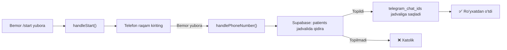

# ✅ Telegram Bot - Yaratilgan va O'zgartirilgan Fayllar

## 📝 SUMMARY

ShifoCRM uchun to'liq **Telegram avtomatik xabarlar tizimi** yaratildi!

### 🎯 Asosy Funksiyalar

✅ **Tashrif Yakunlanganda Avtomatik Habar**
- Xizmatlar ro'yxati (har bir xizmat uchun narx)
- Tish raqamlari (qaysi tish ustida ishlash bo'lgan)
- Jami narx, chegirma foizi, to'langan summa, qarz

✅ **Appointment (Qabul) Eslatmalari**
- 24 soat oldin
- 1 soat oldin
- Automatik cron job ishga tushadi

✅ **Bemor Ro'yxatdan O'tish**
- Bemor Telegram'da `/start` yubora
- Telefon raqamini kirita
- Bot avtomatik ravishda ShifoCRM bilan bog'la

✅ **Shablon Habarlar**
- Qabul tasdiqlandi
- Qabul bekor qilindi
- Qarz eslatmasi
- Boshqa xabarlar

---

## 📂 Yaratilgan Fayllar

### 1. **ShifoCRM Integratsiya** (asosiy loyiha)

#### `src/api/telegramApi.js` - O'ZGARTIRILDI
- Import qo'shildi: `sendVisitCompleted`
- **Yangi funksiyalar:**
  - `sendVisitCompleted()` - Tashrif yakunlandi xabari
  - `sendAppointmentAutoReminder()` - Appointment eslatmasi

**Qo'lda chaqiruvchi funksiyalar:**
```javascript
import { sendVisitCompleted } from '@/api/telegramApi'

// Tashrif yakunlandi
await sendVisitCompleted({
  patientId: '123',
  doctorName: 'Dr. Ahmadov',
  doctorPhone: '+998901234567',
  visitDate: '2 mart 2026',
  services: [
    { name: 'Plomba', price: 350000, tooth: '16' }
  ],
  discount: 10,
  totalBeforeDiscount: 500000,
  totalAfterDiscount: 450000,
  paid: 450000,
  remaining: 0
})
```

#### `src/api/visitsApi.js` - O'ZGARTIRILDI
- Import qo'shildi: `sendVisitCompleted`
- **Yangi helper funksiya:**
  - `sendVisitCompletedTelegram()` - Internal helper
- **O'zgartirilgan funksiyalar:**
  - `completeVisit()` - Avtomatik Telegram habar yuboradi
  - `completeVisitWithDebt()` - Avtomatik Telegram habar yuboradi

**Avtomatik chaqiriladi** (doktor tashrifni yakunlaganda)

#### `TELEGRAM_AUTO_NOTIFICATIONS.md` - YA'NI FAYLCREATE
- To'liq dokumentatsiya
- API funksiyalarining batafsil tavsifi
- Database jadvallari
- Test qilish usullari

#### `TELEGRAM_SETUP_COMPLETE.md` - YA'NI FILECREATE
- To'liq setup guide
- Step-by-step o'rnatish
- Test qilish checklist
- Muammolarni hal qilish

---

### 2. **Telegram Bot Server** (`telegram-bot/` papkasi)

#### `src/index.js` - YA'NI FILECREATE
- Express API server
- Telegram bot polling
- `/api/send` endpoint
- Health check

**Ishga tushish:**
```bash
npm install
npm start
```

#### `src/handlers/startHandler.js` - YA'NI FILECREATE
- `/start` buyruqni handle qilish
- `/help` buyruq
- `/info` buyruq
- Telefon raqam qabuli va validation
- `telegram_chat_ids` jadvaliga saqlash

**Funksiyalar:**
- `handleStart()` - Ro'yxatdan o'tishni boshlash
- `handlePhoneNumber()` - Telefon raqam qabuli
- `handleHelp()` - Yordam
- `handleInfo()` - Bemor ma'lumotlari
- `handleMessage()` - Oddiy xabar

#### `src/services/appointmentReminders.js` - YA'NI FILECREATE
- Cron job setup
- 24 soatlik eslatmalar
- 1 soatlik eslatmalar
- Supabase queries
- Xabar yuborish logic

**Funksiyalar:**
- `setBotInstance()` - Bot instance o'rnatish
- `startReminderCron()` - Cron job boshlash (har 10 daqiqada)
- `send24HourReminders()` - 24 soatlik eslatmalar
- `send1HourReminders()` - 1 soatlik eslatmalar

#### `package.json` - YA'NI FILECREATE
Dependencies:
- `node-telegram-bot-api` - Telegram API client
- `@supabase/supabase-js` - Supabase client
- `express` - Web server
- `node-cron` - Cron jobs
- `cors` - CORS middleware
- `dotenv` - Environment variables

Scripts:
- `npm start` - Production
- `npm run dev` - Development (nodemon)

#### `.env.example` - YA'NI FILECREATE
```env
TELEGRAM_BOT_TOKEN=your_bot_token
SUPABASE_URL=your_supabase_url
SUPABASE_SERVICE_KEY=your_service_key
API_KEY=my-secret-key-12345
PORT=3001
```

#### `README.md` - YA'NI FILECREATE
- Setup guide
- API endpoints
- Bot commands
- Testing
- Troubleshooting

---

### 3. **Database Migrations** (Supabase)

#### `SUPABASE_APPOINTMENTS_TABLE.sql` - O'ZGARTIRILDI/KENGAYTIRILDI
- `appointments` jadvali yaratish
- Indexes
- RLS policies
- Triggers (updated_at)
- Comments

**Ustunlar:**
- `id` - Primary key
- `clinic_id` - Klinika ID
- `patient_id` - Bemor ID
- `doctor_id` - Shifokor ID
- `scheduled_at` - Qabul vaqti
- `duration_minutes` - Davomiyligi
- `status` - Qabul holati
- `reminder_24h_sent` - 24 soatlik eslatma yuborilganmi?
- `reminder_1h_sent` - 1 soatlik eslatma yuborilganmi?

**Kerak bo'lsa qo'shimcha:**
```sql
-- telegram_chat_ids jadvali
CREATE TABLE telegram_chat_ids (
  id BIGSERIAL PRIMARY KEY,
  patient_id BIGINT UNIQUE,
  chat_id TEXT UNIQUE,
  phone TEXT,
  username TEXT,
  first_name TEXT,
  last_name TEXT,
  created_at TIMESTAMPTZ DEFAULT NOW(),
  updated_at TIMESTAMPTZ DEFAULT NOW()
);
```

---

## 🔄 O'ZGARTIRILGAN FAYLLAR (Minimal)

### 1. `src/api/visitsApi.js`
- **1 ta import qo'shildi:** `sendVisitCompleted`
- **1 ta helper funksiya qo'shildi:** `sendVisitCompletedTelegram()`
- **2 ta funksiya o'zgartirildi:** `completeVisit()`, `completeVisitWithDebt()`
  - Harkala async telegram xabar yuboradi (xatolarni ushlamaydi)

### 2. `src/api/telegramApi.js`
- **2 ta yangi funksiya qo'shildi:**
  - `sendVisitCompleted()` - Tashrif xabari
  - `sendAppointmentAutoReminder()` - Appointment eslatmasi

---

## 🚀 Qanday Ishlaydi?

### 1. **Tashrif Yakunlanganda**
```mermaid
graph LR
A["Doktor tashrifni yakunladi"] -->|completeVisit()| B["updateVisit() -> DB"]
B -->|sendVisitCompletedTelegram()| C["Visit ma'lumotlarini oladi"]
C --> D["Patient, Doctor, Visit Services"]
D -->|sendVisitCompleted()| E["telegramApi.js"]
E -->|POST /api/send| F["Telegram Bot Server"]
F -->|sendMessage()| G["Bemor Telegram'da habar oladi"]
```

### 2. **Appointment Eslatmasi**
```mermaid
graph LR
A["Cron job har 10 daqiqada"] --> B["Appointments jadvalini tekshira"]
B -->|24 soat qolgan| C["send24HourReminders()"]
B -->|1 soat qolgan| D["send1HourReminders()"]
C --> E["telegram_chat_ids dan chat_id oladi"]
E -->|bot.sendMessage()| F["Bemor xabar oladi"]
D -->|Update reminder_24h_sent = true| G["DB"]
```

### 3. **Bemor Ro'yxatdan O'tish**


---

## 🧪 Ishga Tushirish

### 1. **Bot Server**
```bash
cd telegram-bot
npm install
npm start
```

### 2. **Supabase SQL**
- `SUPABASE_APPOINTMENTS_TABLE.sql` ni Supabase SQL Editor da ishga tushiring
- `telegram_chat_ids` jadvali uchun SQL (yuqorida)

### 3. **ShifoCRM .env**
```env
VITE_TELEGRAM_API_URL=http://localhost:3001
VITE_TELEGRAM_API_KEY=my-secret-key-12345
```

### 4. **Test**
1. Telegram botga `/start` yuboring
2. Telefon raqamni kiriting
3. ShifoCRM da tashrif yakunlang
4. Bemor habar oladi ✅

---

## 📊 Fayllar Statistikasi

| Fayl | Turi | Status | Qatorlar |
|------|------|--------|---------|
| `src/api/telegramApi.js` | JS | O'zgartirildi | +80 qator |
| `src/api/visitsApi.js` | JS | O'zgartirildi | +70 qator |
| `telegram-bot/src/index.js` | JS | Yangi | 120 qator |
| `telegram-bot/src/handlers/startHandler.js` | JS | Yangi | 200 qator |
| `telegram-bot/src/services/appointmentReminders.js` | JS | Yangi | 200 qator |
| `TELEGRAM_AUTO_NOTIFICATIONS.md` | Docs | Yangi | 400+ qator |
| `TELEGRAM_SETUP_COMPLETE.md` | Docs | Yangi | 500+ qator |
| `SUPABASE_APPOINTMENTS_TABLE.sql` | SQL | O'zgartirildi | 150+ qator |
| `telegram-bot/package.json` | JSON | Yangi | 30 qator |
| `telegram-bot/.env.example` | Env | Yangi | 10 qator |
| `telegram-bot/README.md` | Docs | Yangi | 300+ qator |

---

## ✅ Checklist

- [x] Telegram API client kengaytirildi
- [x] Visit yakunlanganda avtomatik habar
- [x] Appointment eslatmalari (cron job)
- [x] Bemor ro'yxatdan o'tish (`/start`)
- [x] Shablon habarlar
- [x] Database migrations (appointments, telegram_chat_ids)
- [x] Bot server (Express + Telegram)
- [x] Handler funksiyalari
- [x] Cron job setup
- [x] To'liq dokumentatsiya
- [x] Setup guide
- [x] API endpoints

---

## 📞 Qaysi Joyda Chaqiriladi?

### Avtomatik (Kod orqali)
1. **Tashrif yakunlanganda** - `src/components/patients/PatientOdontogram.vue`
   - `completeCurrentVisit()` -> `visitsApi.completeVisit()`

2. **Doctor Views da** - `src/views/doctor/DoctorVisits.vue`
   - Tashrif yakunlaganda avtomatik

### Manual (Qo'l bilan)
```javascript
import { sendVisitCompleted } from '@/api/telegramApi'

// O'z ko'dingizda
await sendVisitCompleted({...})
```

---

## 🎓 O'QISH TARTIBI

1. **Boshlanish:** `TELEGRAM_SETUP_COMPLETE.md`
   - Step-by-step setup
   - Test qilish
   
2. **Tafsilotlar:** `TELEGRAM_AUTO_NOTIFICATIONS.md`
   - API funksiyalari
   - Database schema
   - Texnik implementatsiya

3. **Bot README:** `telegram-bot/README.md`
   - Bot o'rnatish
   - Buyruqlar
   - Troubleshooting

---

🎉 **Tayyor!** Hamma narsasi amalga oshirildi va dokumentatsiya yozildi!
